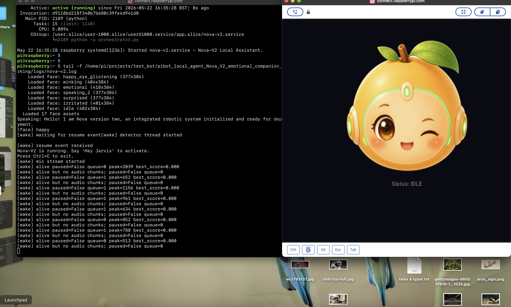
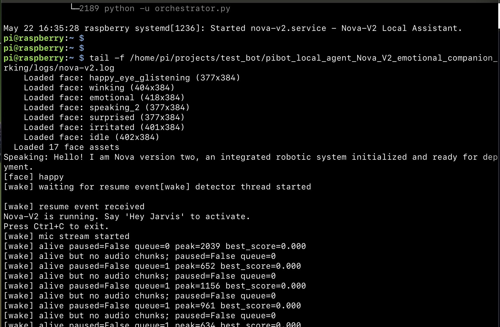
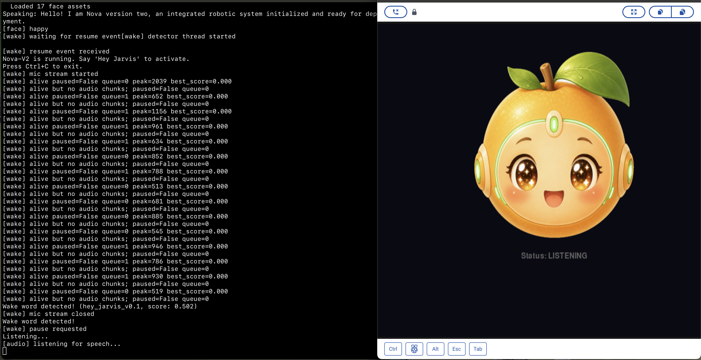
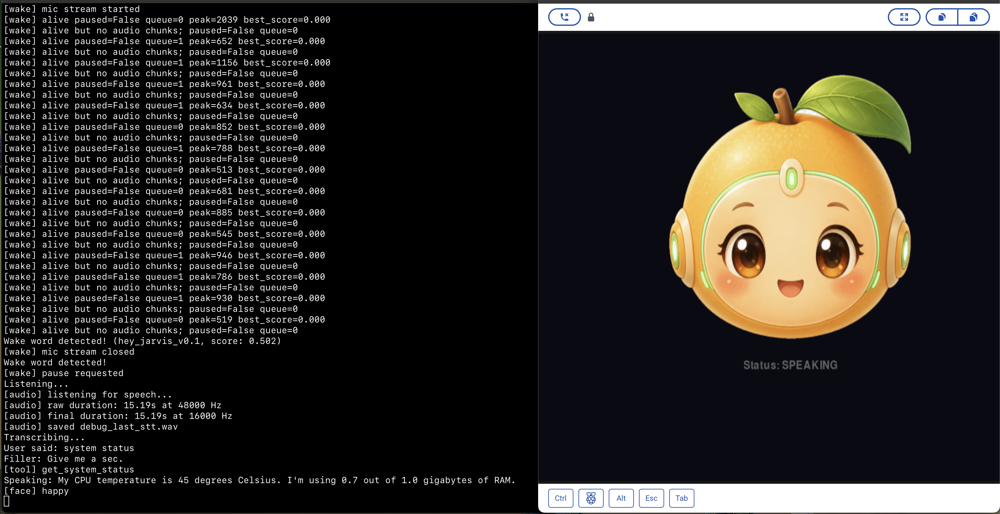
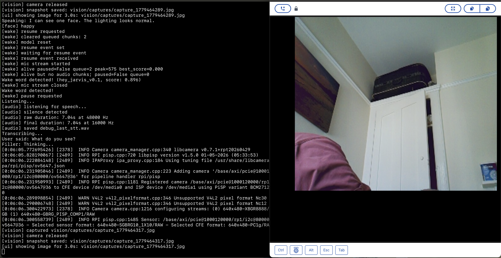
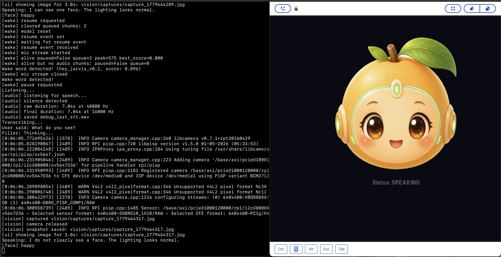
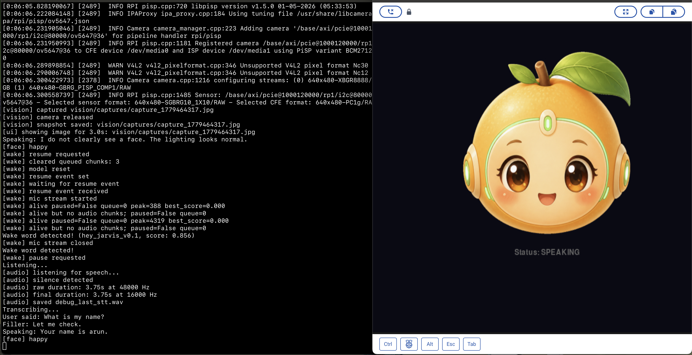
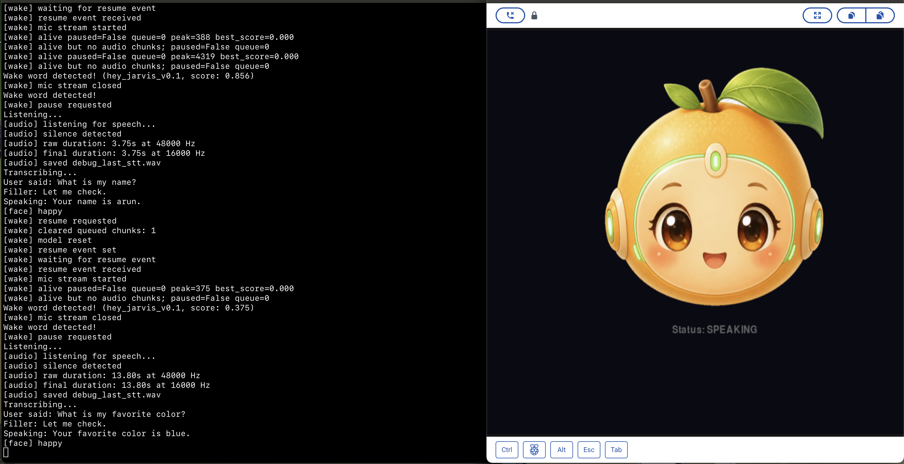
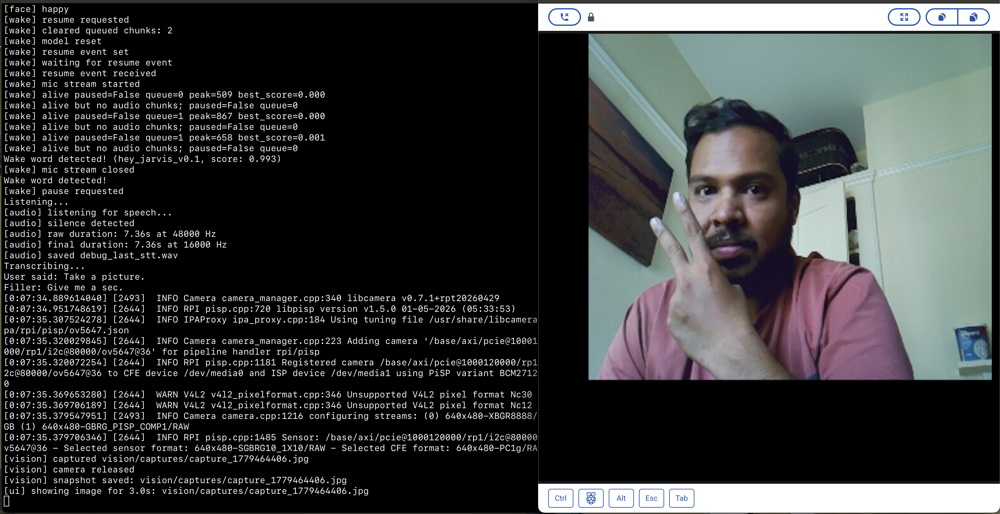

# PiBot — Voice Assisted local AI agent for Raspberry Pi 5

A fully offline, wake-word-activated voice assistant that runs on a **Raspberry Pi 5**. Simple queries are handled locally by a 1.5 B parameter LLM; complex questions are handed off to a cloud model. Named after [Karl Nova-V2](https://en.wikipedia.org/wiki/Karl_Guthe_Nova-V2), the pioneer of radio astronomy.


## System Architecture

```
┌─────────────────────────────────────────────────────────────────┐
│                        RASPBERRY PI 5                           │
│                                                                 │
│  ┌──────────┐    "Hey Nova-V2"     ┌──────────────────────────┐  │
│  │ USB Mic  │ ──────────────────► │  Wake Word Detector      │  │
│  │ (48kHz)  │                     │  (openWakeWord + ONNX)   │  │
│  └──────────┘                     └───────────┬──────────────┘  │
│                                               │ wake!           │
│                                               ▼                 │
│                                   ┌──────────────────────────┐  │
│                                   │  Audio Manager           │  │
│                                   │  Record → Silence detect │  │
│                                   └───────────┬──────────────┘  │
│                                               │ raw audio       │
│                                               ▼                 │
│                                   ┌──────────────────────────┐  │
│                                   │  Whisper.cpp (STT)       │  │
│                                   │  48kHz → 16kHz → text    │  │
│                                   └───────────┬──────────────┘  │
│                                               │ text            │
│                                               ▼                 │
│  ┌────────────────────────────────────────────────────────────┐  │
│  │                    LLM Router (Ollama)                     │  │
│  │                   Qwen 2.5 · 1.5 B                        │  │
│  │                                                            │  │
│  │  Simple chat ──► respond directly                          │  │
│  │  Time/Date   ──► time_tool        (local)                  │  │
│  │  Weather     ──► weather_tool     (OpenWeatherMap API)     │  │
│  │  News        ──► news_tool        (NewsAPI)                │  │
│  │  System      ──► system_tool      (CPU temp, RAM, uptime)  │  │
│  │  Jokes       ──► joke_tool        (Official Joke API)      │  │
│  │  Complex     ──► cloud_handoff    (Kimi K2 / Moonshot)     │  │
│  └────────────────────────────────┬───────────────────────────┘  │
│                                   │ response text               │
│                                   ▼                              │
│                       ┌──────────────────────┐                   │
│                       │  Piper TTS           │                   │
│                       │  text → speech (.wav)│                   │
│                       └──────────┬───────────┘                   │
│                                  │                               │
│                 ┌────────────────┼────────────────┐              │
│                 ▼                                  ▼              │
│        ┌──────────────┐                  ┌────────────────┐      │
│        │  USB Speaker │                  │  PyGame Face   │      │
│        │  (ALSA)      │                  │  (800×480 LCD) │      │
│        └──────────────┘                  └────────────────┘      │
└─────────────────────────────────────────────────────────────────┘
```

---

## Features

| Feature | How it works | API key needed? |
|---|---|---|
| **Wake word** — "Hey Nova-V2" | Custom openWakeWord ONNX model | No |
| **Local chat** — greetings, identity, simple Q&A | Qwen 2.5:1.5b via Ollama | No |
| **Time & date** | Python `datetime` | No |
| **System status** — CPU temp, RAM, uptime, disk | Reads `/proc` and `/sys` | No |
| **Jokes** | Official Joke API (free, no key) | No |
| **Weather** | OpenWeatherMap | `OPENWEATHER_API_KEY` |
| **News headlines** | NewsAPI | `NEWSAPI_KEY` |
| **Cloud AI answers** — complex / creative queries | Kimi K2 (Moonshot) | `MOONSHOT_API_KEY` |
| **Animated face UI** | PyGame on Wayland (800×480 LCD) | No |
| **Natural speech** | Piper TTS (British English voice) | No |
| **Speech recognition** | Whisper.cpp (quantised base.en model) | No |

---

## Hardware Requirements

- Raspberry Pi 5 (4 GB+ RAM recommended)
- USB microphone
- USB speaker
- 800×480 LCD display *(optional — Nova-V2 works headless too)*
- MicroSD card (32 GB+)

---

## Quick Start (One-Command Install)

> **Prerequisite:** A fresh **Raspberry Pi OS (Bookworm, 64-bit)** installation with internet access.

### 1. Clone the repo

```bash
git clone https://github.com/mayukh4/pibot_local_agent.git
cd pibot_local_agent
```

### 2. Run the install script

```bash
chmod +x setup.sh
./setup.sh
```

This single script handles **everything** listed in the [Manual Installation](#manual-installation) section below. It takes ~15-20 minutes on a Pi 5 depending on your internet speed.

### 3. Add API keys (optional)

```bash
cp .env.example .env
nano .env          # paste your keys
```

| Key | Where to get it | What you lose without it |
|---|---|---|
| `OPENWEATHER_API_KEY` | [openweathermap.org/api](https://openweathermap.org/api) (free tier) | Weather lookups |
| `NEWSAPI_KEY` | [newsapi.org](https://newsapi.org/) (free tier) | News headlines |
| `MOONSHOT_API_KEY` | [platform.moonshot.ai](https://platform.moonshot.ai/) | Cloud AI for complex questions |

### 4. Run Nova-V2

```bash
source venv313/bin/activate
python orchestrator.py
```

Say **"Hey Nova-V2"** and start talking.

---

## Manual Installation

Use this if you prefer to install step-by-step instead of using `setup.sh`.

### 1 — System packages

```bash
sudo apt update && sudo apt install -y \
  python3.13 python3.13-venv python3.13-dev \
  build-essential cmake git curl wget \
  libsdl2-dev libsdl2-mixer-dev libsdl2-ttf-dev \
  portaudio19-dev libasound2-dev \
  libonnxruntime-dev \
  alsa-utils
```

### 2 — Python virtual environment

```bash
python3.13 -m venv venv313
source venv313/bin/activate
pip install --upgrade pip
```

### 3 — Python dependencies

```bash
pip install \
  httpx \
  sounddevice \
  numpy \
  piper-tts \
  openwakeword \
  onnxruntime \
  pygame
```

### 4 — Ollama + Qwen 2.5

```bash
curl -fsSL https://ollama.com/install.sh | sh
ollama pull qwen2.5:1.5b
```

### 5 — Whisper.cpp

```bash
git clone https://github.com/ggerganov/whisper.cpp.git
cd whisper.cpp
cmake -B build
cmake --build build --config Release
sudo cp build/bin/whisper-cli /usr/local/bin/whisper-cpp

# Download the quantised English model
bash models/download-ggml-model.sh base.en
# Quantise it (smaller + faster on Pi)
./build/bin/quantize models/ggml-base.en.bin models/ggml-base.en-q5_0.bin q5_0
cd ..
```

### 6 — Piper TTS voice

```bash
mkdir -p piper/voices
# Download British English voice (or pick another from https://rhasspy.github.io/piper-samples/)
wget -O piper/voices/en_GB-semaine-medium.onnx \
  https://huggingface.co/rhasspy/piper-voices/resolve/main/en/en_GB/semaine/medium/en_GB-semaine-medium.onnx
wget -O piper/voices/en_GB-semaine-medium.onnx.json \
  https://huggingface.co/rhasspy/piper-voices/resolve/main/en/en_GB/semaine/medium/en_GB-semaine-medium.onnx.json
```

### 7 — Wake word model

The custom **"Hey Nova-V2"** ONNX model is already in `models/wake_word/`. If you want to train your own, see [openWakeWord docs](https://github.com/dscripka/openWakeWord).

### 8 — API keys

```bash
cp .env.example .env
nano .env   # fill in your keys (all optional)
```

### 9 — Run

```bash
source venv313/bin/activate
python orchestrator.py
```

---

## Project Structure

```
nova-v2/
├── orchestrator.py              # Main entry point — ties everything together
├── config.py                    # Dataclass config, loads .env + config.json
├── setup.sh                     # One-command install script
├── .env.example                 # Template for API keys
│
├── audio/
│   ├── audio_manager.py         # Mic recording (silence detection) + speaker playback
│   ├── tts_engine.py            # Piper TTS wrapper (text → WAV)
│   └── stt_engine.py            # Whisper.cpp wrapper (audio → text)
│
├── brain/
│   ├── router.py                # Intent routing — keyword + LLM tool-calling
│   ├── ollama_client.py         # Ollama HTTP client (chat + streaming)
│   ├── cloud_client.py          # Kimi K2 / Moonshot HTTP client
│   ├── tool_definitions.py      # Tool schemas + system prompt for Qwen
│   └── tools/
│       ├── time_tool.py         # Current time & date
│       ├── weather_tool.py      # OpenWeatherMap lookup
│       ├── news_tool.py         # NewsAPI top headlines
│       ├── system_tool.py       # CPU temp, RAM, uptime, disk
│       └── joke_tool.py         # Random joke API
│
├── senses/
│   └── wake_word_detector.py    # openWakeWord listener (threaded)
│
├── ui/
│   └── ui_manager.py            # PyGame animated face (Wayland/framebuffer)
│
├── config/
│   ├── config.json              # Runtime config (paths, thresholds, display)
│   ├── local_soul.md            # Personality prompt for local LLM
│   └── cloud_soul.md            # Personality prompt for cloud LLM
│
├── assets/
│   ├── face/                    # PNG face expressions for the UI
│   └── fillers/                 # Pre-generated filler WAVs ("Thinking...", etc.)
│
├── models/
│   └── wake_word/
│       └── Hey_Nova-V2.onnx      # Custom wake word model
│
├── piper/voices/                # Piper TTS voice files (downloaded during setup)
├── whisper.cpp/                 # Whisper.cpp source + compiled binary + model
└── tests/
    ├── test_router.py           # Router / intent detection tests
    ├── test_wake_word.py        # Wake word detector test
    └── test_audio_pipeline.py   # End-to-end audio pipeline test
```

---

## Configuration

All runtime settings live in `config/config.json`. Key values:

| Setting | Default | Description |
|---|---|---|
| `chat_model` | `qwen2.5:1.5b` | Ollama model for routing + chat |
| `wake_word_threshold` | `0.5` | Wake word confidence threshold (0–1) |
| `mic_sample_rate` | `48000` | Native sample rate of your USB mic |
| `local_location` | `Kingston, CA` | Default city for weather lookups |
| `display_width` / `display_height` | `800` / `480` | UI resolution |
| `enable_ui` | `true` | Set `false` to run headless |

API keys are loaded from `.env` and are **never** written to `config.json`.

---

## Testing Individual Components

```bash
source venv313/bin/activate

# Test the LLM router (requires Ollama running)
python tests/test_router.py

# Test wake word detection
python tests/test_wake_word.py

# Test full audio pipeline (mic → STT → TTS → speaker)
python tests/test_audio_pipeline.py
```

---

## How It Works (Flow)

1. **Wake word** — Nova-V2 continuously listens for "Hey Nova-V2" via a custom openWakeWord ONNX model running on a background thread.
2. **Record** — Once triggered, the mic stream is paused from wake-word duty and handed to the Audio Manager, which records until silence is detected (1.5 s of quiet).
3. **Transcribe** — The recorded audio (48 kHz) is downsampled to 16 kHz and sent to Whisper.cpp, which returns the text.
4. **Route** — The Router sends the text to Ollama (Qwen 2.5:1.5b) with tool-calling enabled. If the model returns a structured tool call, that tool runs. Otherwise, keyword-based fallback detection kicks in.
5. **Respond** — The response text is synthesised to speech by Piper TTS and played through the USB speaker via ALSA.
6. **UI** — Throughout the flow the PyGame face reflects the current state: idle → listening → thinking → speaking → idle.

---

## Troubleshooting

| Problem | Fix |
|---|---|
| `Mic 'USB PnP Sound Device' not found` | Check `arecord -l`. Update `MIC_NAME` in `audio/audio_manager.py` and `senses/wake_word_detector.py` to match your mic's name. |
| `Speaker 'UACDemoV1.0' not found` | Check `aplay -l`. Update `SPEAKER_NAME` in `audio/audio_manager.py`. |
| Whisper not found | Run `which whisper-cpp`. If it's elsewhere, update `whisper_path` in `config/config.json`. |
| Ollama not running | Run `ollama serve` in another terminal, then `ollama pull qwen2.5:1.5b`. |
| No display / PyGame crash | Set `"enable_ui": false` in `config/config.json` to run headless. |
| Weather / News / Cloud AI says "not configured" | Add the matching API key to `.env`. |

---

## Nova-V2 Working Demo Screenshots

These screenshots document Nova-V2 running on Raspberry Pi with service-based startup, live logs, wake-word detection, UI states, camera capture, and vision response.

### Service and Runtime Logs







### UI States




### Camera and Vision









### Background Service Operation



## License

MIT

---

## Nova-V2 Working Demo Screenshots

These screenshots document Nova-V2 running on Raspberry Pi with service-based startup, live logs, wake-word detection, UI states, camera capture, and vision response.

### Service and Runtime Logs


### UI States


### Camera and Vision


### Background Service Operation


